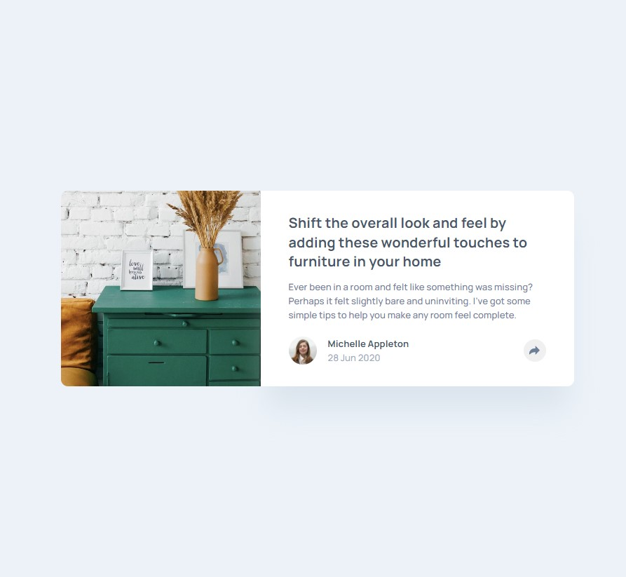
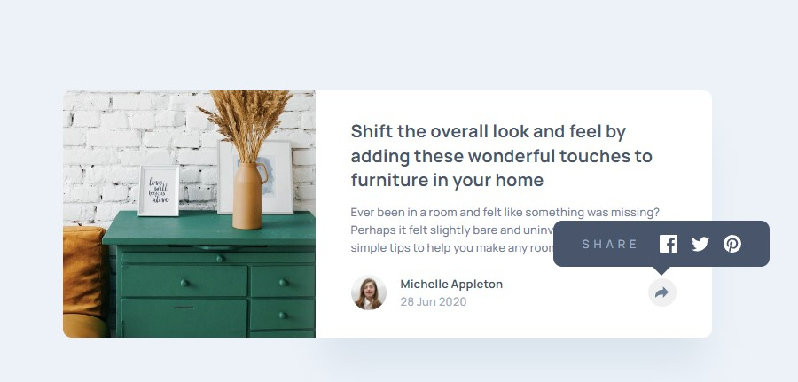
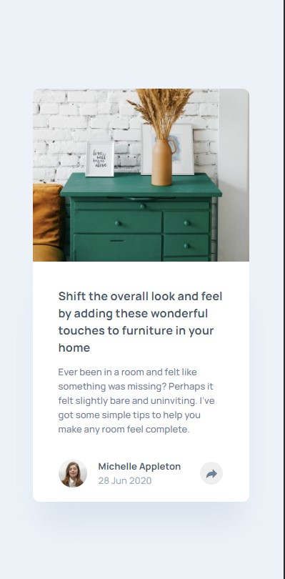
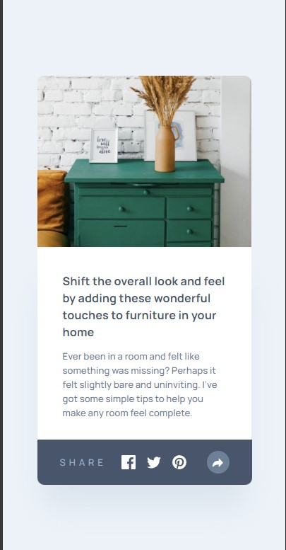

### Screenshot






## My process

### Built with

- Semantic HTML5 markup
- CSS custom properties
- Flexbox
- JavaScript

### What I learned


```js
const setVisibility = () => {
  sharedCard.classList.toggle("hidden")
}

shareButton.addEventListener("click", setVisibility)

shareButtonOpen.addEventListener("click", setVisibility)
```

## Author
- Frontend Mentor - [@frontend-en](https://www.frontendmentor.io/profile/frontend-en)
